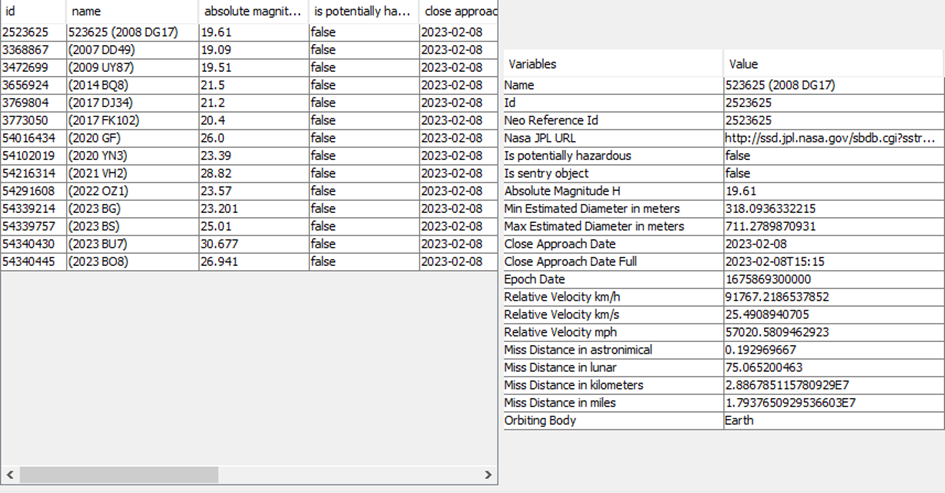

# NASA Asteroid API Application

Projekt realizowany w celach akademickich w dwuosobowych zespołach.

Aplikacja wysyła requesty do bazy danych NASA o obserwowanych asteroidach w ramach ustalonych
dat (domyślnie aktualny dzień). Następnie przetwarza je na obiekty.

Użytkownik ma do wyboru filtrowanie po 4 zmiennych liczbowych. Musi wybrać wartość maksymalną
oraz minimalną, a następnie kliknąć ‘accept filter’. Dodatkowo użytkownik może filtrować
czy dana asteroida jest możliwie niebezpieczna. Jeśli zażyczy on sobie zresetowania nałożonych filtrów –
lista asteroidów wróci do domyślnych ustawień opartych tylko na datach. Ponadto, do jego
dyspozycji jest opcja sortowania po 5 wartościach – 4 odpowiadające filtrom oraz sortowanie po
dacie.

Za każdym razem gdy użytkownik wprowadzi zmiany, lewa tabelka zmieni swoją zawartość w
zależności od nałożonych filtrów oraz rodzaju sortowania. Jeśli użytkownik zażyczy sobie dowiedzieć
się więcej o jednej specyficznej asteroidzie – może kliknąć na nią, a następnie jej dane pokażą się
w prawej tabelce.

